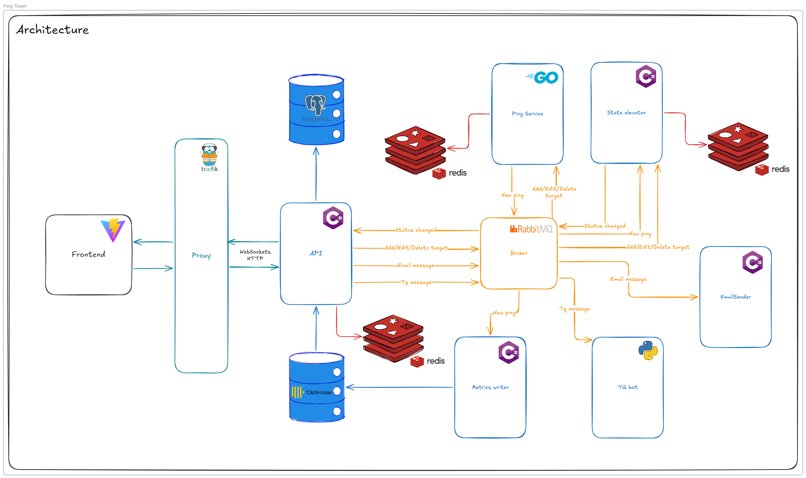

# PingTower

A microservice uptime monitoring system with multi-protocol support, real-time WebSocket updates, and multi-channel notifications.

## Architecture



The system consists of **6 independent services** communicating via RabbitMQ:

| Service | Language / Framework | Role |
|---|---|---|
| **API** | C# / ASP.NET Core 10, MediatR, SignalR | REST API, WebSocket hub, auth, notification routing |
| **Ping Service** | Go | Concurrent health checks via goroutines (one per target) |
| **State Elevator** | C# / .NET Worker Service | Status lifecycle evaluation, failure threshold detection |
| **Metrics Writer** | C# / .NET Worker Service | Batched bulk insert of ping records to ClickHouse |
| **Email Sender** | C# / .NET Worker Service, MailKit, Polly | SMTP notification delivery with retry & circuit breaker |
| **Telegram Bot** | Python / FastAPI, aiogram, faststream | Telegram bot: webhook handler & notification delivery |

**Frontend:** React 19 + TypeScript, Vite, TailwindCSS, Radix UI, Recharts, SignalR client

## Tech Stack

**Messaging:** RabbitMQ — event-driven fanout via topic exchanges

**Databases (polyglot persistence):**
- **PostgreSQL** — transactional data: users (ASP.NET Identity), servers, ping settings, notification settings, tokens, Telegram accounts
- **ClickHouse** — time-series metrics: ping history with latency, RTT min/max, packet loss, TLS/DNS data
- **Redis** — per-service state with isolated key namespaces

**Infrastructure:** Docker Compose, Makefile (`make up` / `make infra-up` / `make services-up`), nginx (frontend proxy)

## Database Schema


**PostgreSQL:** `servers`, `ping_settings`, `user`, `tokens`, `telegram_accounts`, `notification_settings`

**ClickHouse:** `server_pings` — per-ping record with `latency_ms`, `rtt_min_ms`, `rtt_max_ms`, `packet_loss_percent`, `cert_expires_at`, `tls_version`, `dns_lookup_ms`, `sent_bytes`, `received_bytes`, `ttl`, `is_success`, `status_code`, `error_message`

## RabbitMQ Topology

```
API ──publishes──▶ serverEventsExchange (topic)
                        ├──▶ q.ping-service.server-events     (Ping Service)
                        └──▶ q.state-elevator.server-events   (State Elevator)

Ping Service ────▶ pingEventsExchange (topic)
                        ├──▶ q.metrics-writer.ping-events     (Metrics Writer)
                        └──▶ q.state-elevator.ping-events     (State Elevator)

State Elevator ──▶ statusEventsExchange (topic)
                        └──▶ q.api.status-events              (API → SignalR → Frontend)

API ─────────────▶ emailQueue    (direct) ──▶ Email Sender
API ─────────────▶ telegramQueue (direct) ──▶ Telegram Bot
```

## Redis Key Namespaces

| Service | Key Pattern | Purpose |
|---|---|---|
| API | `api:cooldown:server:{id}:status:{status}` | Per-user notification cooldown |
| Ping Service | `ping-service:target:{id}` | Target config persistence across restarts |
| State Elevator | `state-elevator:config:{id}` | Ping settings snapshot |
| State Elevator | `state-elevator:state:{id}` | Runtime state: consecutive failures, current status (TTL = 3× interval) |

## Data Flow

1. **Server created** → API publishes to `serverEventsExchange` → Ping Service and State Elevator store config in Redis
2. **Ping executed** → Ping Service goroutine runs HTTP/TCP/ICMP check → publishes raw result to `pingEventsExchange`
3. **State evaluated** → State Elevator checks result against thresholds (`FailureThreshold`, `LatencyThresholdMs`) → publishes status change to `statusEventsExchange`
4. **UI updated** → API consumes status change, updates PostgreSQL, pushes via SignalR to Vue frontend
5. **Metrics stored** → Metrics Writer batches ping records (up to 500 / 1 s flush) → bulk insert to ClickHouse
6. **Notifications sent** → API checks Redis cooldown → publishes to `emailQueue` / `telegramQueue` → Email Sender or Telegram Bot deliver alerts

## Protocol Support

Ping Service checks endpoints via **HTTP/HTTPS, TCP, and ICMP** through a unified abstraction. Each target runs in a dedicated goroutine with a configurable interval, retry count, and graceful shutdown via `context.CancelFunc`.

## Notification Channels

All notification consumers are independent and decoupled via RabbitMQ:
- **Email** — SMTP via MailKit with Polly retry (3 attempts, exponential backoff), 10 s timeout, circuit breaker (5 failures → 2 min break)
- **Telegram** — aiogram webhook or polling, with inline keyboards
- **WebSocket** — real-time push to browser via ASP.NET SignalR

Notification settings: `on_down`, `on_up`, `on_latency`, `cooldown_sec` per user.
