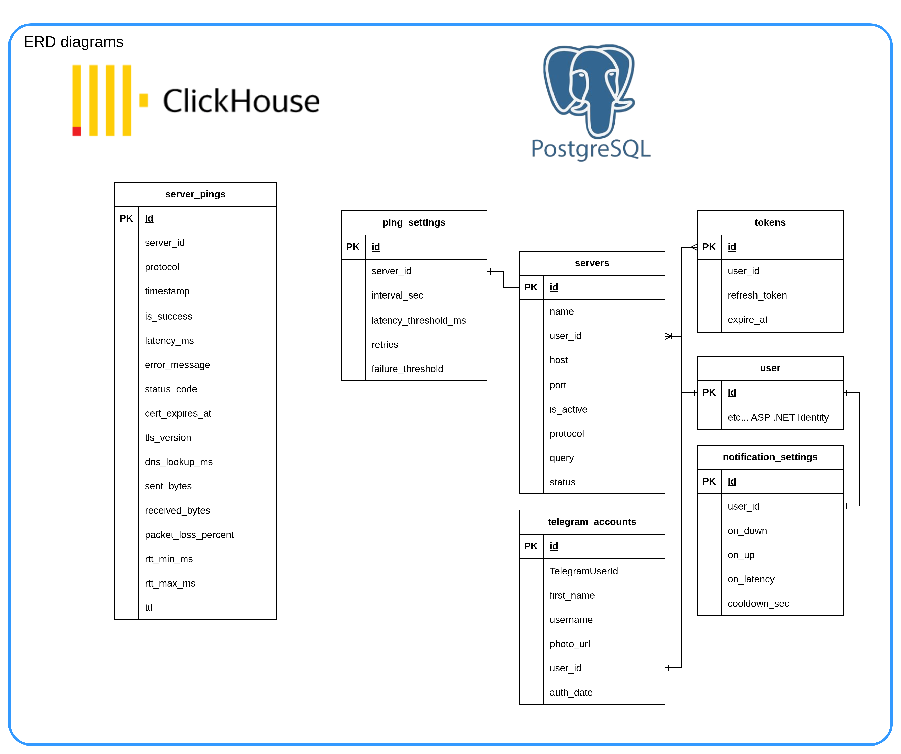

# PingTower

### Real-time server availability monitoring

PingTower probes your servers on a schedule over HTTP/HTTPS, TCP and ICMP, keeps the latency history
and alerts you the moment a server goes down or recovers — in the browser, by email and in Telegram.

---

## How it works

| 📡 Probes | ⚖️ Evaluates | 💾 Stores | 🔔 Alerts |
| :---: | :---: | :---: | :---: |
| A dedicated goroutine per target checks it over HTTP/HTTPS, TCP or ICMP at the configured interval | Consecutive-failure and latency thresholds move the server to `UP` / `DOWN` | Every ping — latency, RTT, packet loss, TLS, DNS — is batched into ClickHouse | Status changes reach the browser via SignalR, email and Telegram, with a cooldown |

 
Independent services talk over RabbitMQ (topic exchanges and work queues)

## Repositories

<table>
<tr><th colspan="2">🖥 Product</th></tr>
<tr>
<td width="48" align="center">⚙️</td>
<td><a href="https://github.com/Ping-Tower/api"><b>api</b></a> — REST API, live status SignalR hub, authentication, notification routing C# · ASP.NET Core 10 · MediatR · SignalR · EF Core · PostgreSQL</td>
</tr>
<tr>
<td align="center">🖥️</td>
<td><a href="https://github.com/Ping-Tower/frontend"><b>frontend</b></a> — dashboard: servers, real-time statuses, latency charts, notification settings React 19 · TypeScript · Vite · TanStack Query · Zustand · Radix UI · Recharts</td>
</tr>
<tr><th colspan="2">📡 Monitoring</th></tr>
<tr>
<td align="center">📡</td>
<td><a href="https://github.com/Ping-Tower/ping-service"><b>ping-service</b></a> — HTTP/HTTPS, TCP and ICMP probes, one goroutine per target Go · pro-bing · RabbitMQ · Redis</td>
</tr>
<tr>
<td align="center">⚖️</td>
<td><a href="https://github.com/Ping-Tower/state-elevator"><b>state-elevator</b></a> — status lifecycle: failure and latency thresholds → <code>UP</code> / <code>DOWN</code> C# · .NET Worker Service · RabbitMQ · Redis</td>
</tr>
<tr>
<td align="center">💾</td>
<td><a href="https://github.com/Ping-Tower/metrics-writer"><b>metrics-writer</b></a> — batched ping history writes to ClickHouse C# · .NET Worker Service · ClickHouse</td>
</tr>
<tr><th colspan="2">🔔 Notifications</th></tr>
<tr>
<td align="center">📨</td>
<td><a href="https://github.com/Ping-Tower/email-service"><b>email-service</b></a> — SMTP email with retries and a circuit breaker C# · .NET Worker Service · MailKit · Polly</td>
</tr>
<tr>
<td align="center">💬</td>
<td><a href="https://github.com/Ping-Tower/tg-bot"><b>tg-bot</b></a> — Telegram bot: account linking and alert delivery Python · FastAPI · aiogram · FastStream</td>
</tr>
<tr><th colspan="2">🏗️ Platform</th></tr>
<tr>
<td align="center">🏗️</td>
<td><a href="https://github.com/Ping-Tower/infra"><b>infra</b></a> — Traefik, PostgreSQL, Redis, ClickHouse, RabbitMQ, logging; one Makefile for the whole stack Docker Compose · Traefik · Loki / Promtail / Grafana · GitLab CI</td>
</tr>
</table>

## Getting started

| I want to… | Go to |
| --- | --- |
| **run everything locally** | [infra](https://github.com/Ping-Tower/infra): `make -C infra up` — storages, broker, migrations and all services |
| **understand the event flow** | the diagram above and the [RabbitMQ topology](https://github.com/Ping-Tower/infra/blob/HEAD/rabbitmq/config/definitions.json) |
| **integrate over REST** | [api](https://github.com/Ping-Tower/api) — endpoints, JWT auth, `/hubs/monitoring` hub |

## Data model

 
<b>PostgreSQL:</b> servers, ping_settings, users, tokens, telegram_accounts, notification_settings · <b>ClickHouse:</b> server_pings

